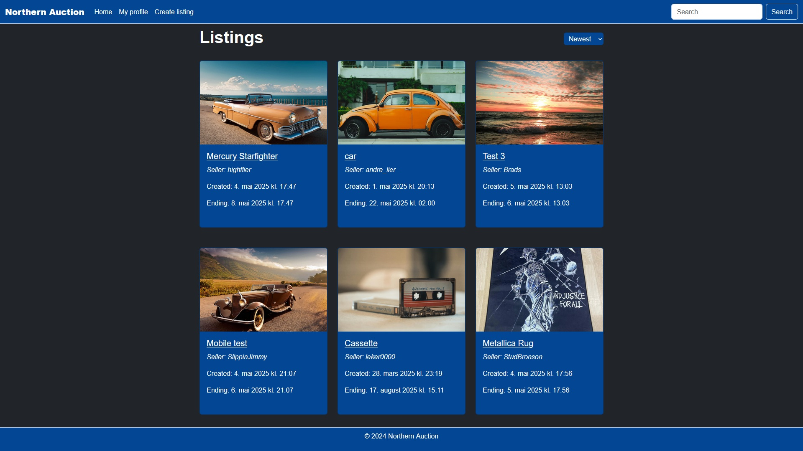

# Northern Auction - Semester Project 2 - Noroff - 2024

## Description

In this semester project we were tasked with creating an auction website using the Noroff API.

## Usage

This auction application you can.

- **Register and login:** Using a "stud.noroff.no" email account. All registered users starts with 1000 credits to use for bidding on listings.
- **View and bid on listings**: You can view other listings and bid on them using credits.
- **Search and sort listings**: You can search for a specific listing, and sort by newest or oldest listings.
- **Manage your listings**: Create, edit and delete your own listings.
- **Edit profile:** Bio and avatar (profile picture).

## Installation

**Prerequisites:** This project uses [Node.js and Node Package Manager (npm)](https://nodejs.org/en/download/)

1. **Clone the repository:** `git clone https://github.com/aBadMan91/semester-project-2`

2. **Navigate to the project directory:** `cd semester-project-2`

3. **Install the dependencies:** `npm install`

## Scripts

- `npm run dev`: Start the development server
- `npm run build`: Build the project for production
- `npm run serve`: Serve the built project

## Built with

- HTML
- SASS/SCSS
- JavaScript
- Bootstrap
- Bootstrap Icons
- Vite

## Contributions

This is a school project and I'm not looking for contributions, but feel free to look at it.

## Acknowledgments

I want to say thanks to

- Noroff for the API
- Lorem Picsum for the images used when creating listings.
- Classmates on Discord.
